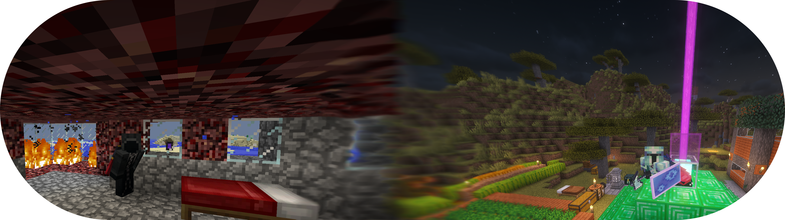
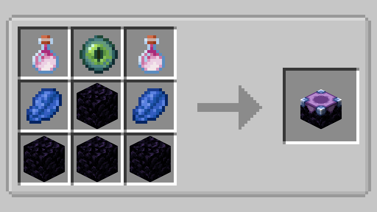
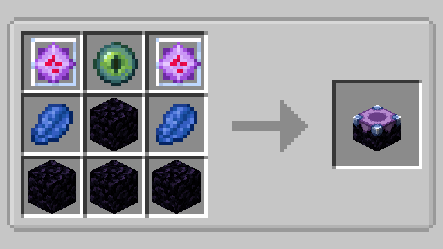
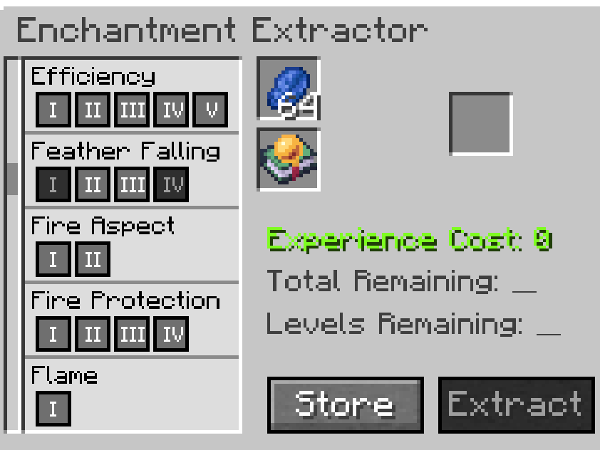
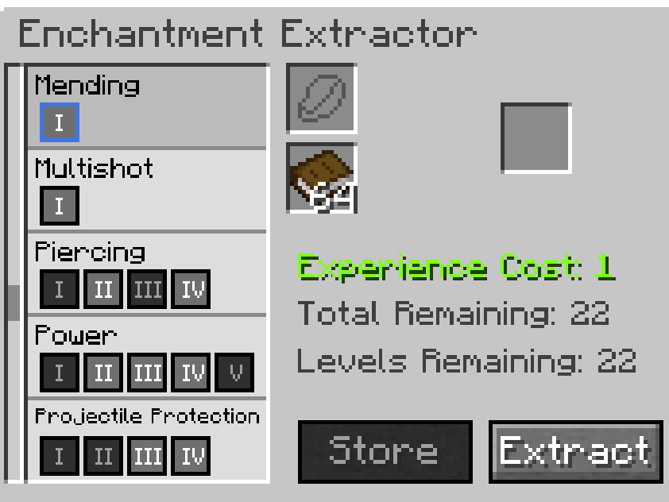
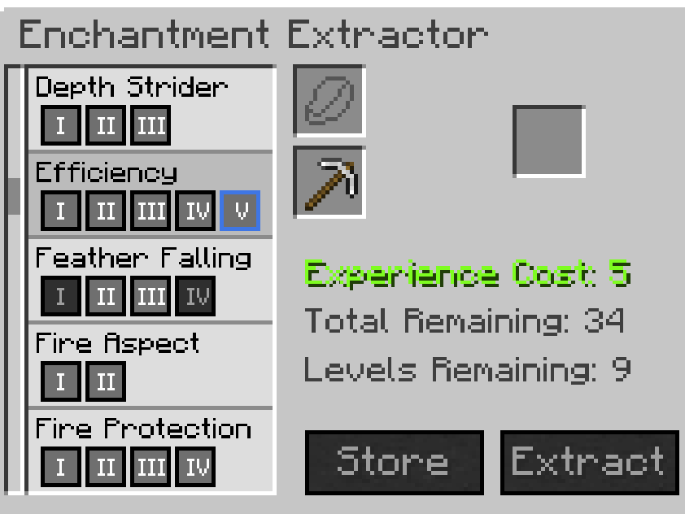
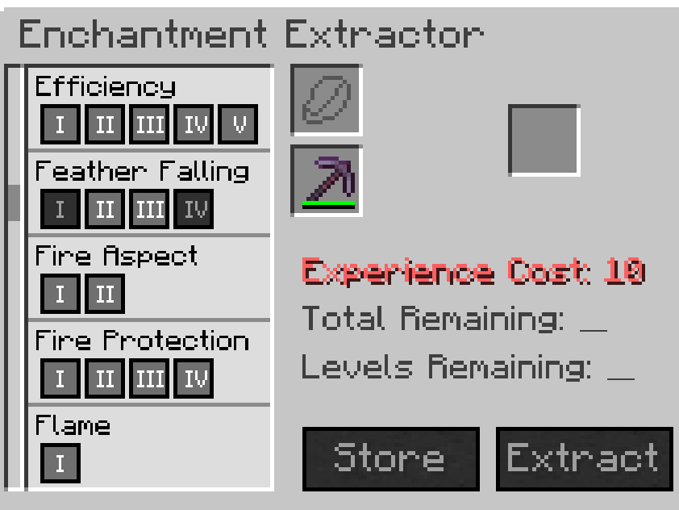
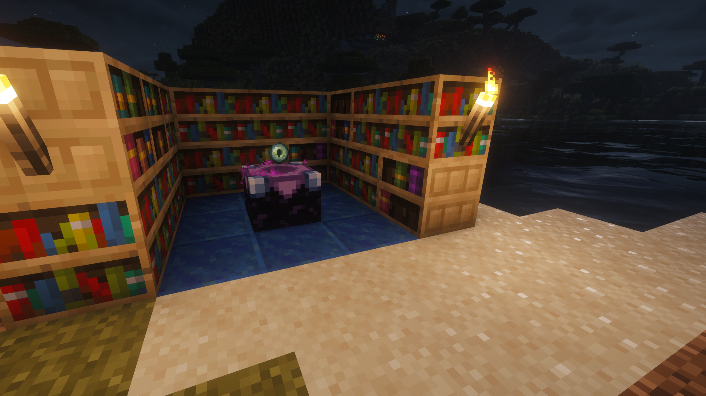
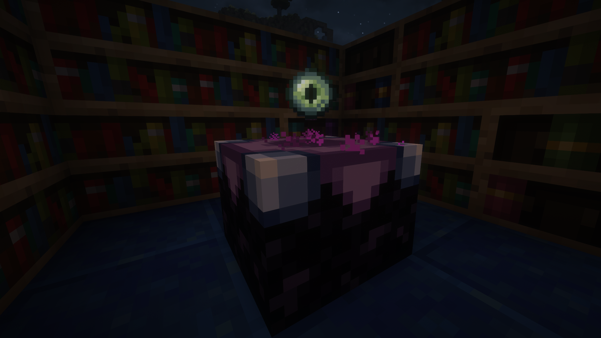

<h1 align="center" id="enchantment-storage">Enchantment Storage</h1>

<p align="center">
	
	
	
	
</p>

<h6 align="center" id="lexx-mod">A Lexxeous Mod</h5>

<p align="center">
	
</p>

# Table of Contents

- [Summary](#summary)
- [Player Usage](#player-usage)
  - [Installation](#installation)
  - [Crafting Recipes](#crafting-recipes)
  - [GUI Basics](#gui-basics)
  - [Store & Extract Flow](#store--extract-flow)
  - [Experience & Lapis Cost](#experience--lapis-cost)
  - [Compatibility](#compatibility)
- [Hopper Behavior](#hopper-behavior)
- [Gallery](#gallery)
- [Debug Commands](#debug-commands)
- [Developer Notes](#developer-notes)
  - [Gradle](#gradle)
  - [JVM Args](#jvm-arguments)
  - [Spotless](#spotless)
  - [Unit Testing](#unit-testing)
  - [Game Testing](#game-testing)
  - [Enchantment Registry](#enchantment-registry)
- [Clean Code Guidelines](#clean-code-guidelines)
- [Source Regions](#source-regions)
- [Unit Test Regions](#unit-test-regions)
- [GitHub Repository](#repository)
- [PRs & Issues](#prs--issues)
- [Donations](#donations)
- [License](#license)

## Summary

The Enchantment Storage mod adds one new block to Minecraft, the *Enchantment Extractor*.
The purpose of the Enchantment Extractor is to provide a centralized place to store all the enchantments you collect.
This mod was born from the frustration of overflowing inventory, chests, & shulker boxes with unstackable enchanted items.
So instead of wasting valuable storage space, and spending way too much time organizing enchanted items,
now you can remove the enchantments and use them somewhere else. Of course this benefit doesn't come for free.
Each transaction of *storing* or *extracting* enchantments costs 1 experience level per enchantment level. But,
this cost can be reduced, or even nullified, by consuming lapis lazuli. Work smart, not hard. Save space, time, & sanity. 

## Player Usage

### Installation

- Download the **Enchantment Storage** `.jar` file.
- Place the `enchantment_storage-x.y.z.jar` file into your Minecraft `mods/` folder.
- Use the same Minecraft version as this mod (`1.21.10`).
- Ensure
[Fabric Loader](https://fabricmc.net/use/installer/) &
[Fabric API](https://www.curseforge.com/minecraft/mc-mods/fabric-api/files/all?version=1.21.10&gameVersionTypeId=4) are installed.

### Crafting Recipes

There are two valid shaped recipes to craft an *Enchantment Extractor*, requiring the following materials:

  * Obsidian x4
  * Lapis Lazuli x2
  * Ender Eye x1
  * Dragon's Breath or End Crystal x2

<p align="center">
	
	
</p>

### GUI Basics

#### Slot layout:
  - Top input slot can only hold lapis lazuli
  - Bottom input slot can only hold books, enchanted books, or enchanted items
  - Right slot is output only
#### Action buttons:
  - `Store`: pulls enchantments from bottom input slot into internal storage
  - `Extract`: applies selected enchantment onto a book (cannot extract onto other items)

> NOTE: You cannot extract enchantments directly onto items or tools, only books or enchanted books.

### Store & Extract Flow

1. Place lapis lazuli in top input slot.
2. Place an enchanted item or enchanted book in input slot, then click `Store`.
3. Select a stored enchantment level from the list.
4. Place a book or enchanted book in bottom input slot, then click `Extract`.
5. Take result from output slot.

### Experience & Lapis Cost

- `Store` XP cost = total sum of enchantment levels on input item, book, or enchanted book.
- `Extract` XP cost = selected enchantment level (*Mending* costs 1 level. *Smite V* costs 5 levels.)
- Lapis lazuli gives a direct discount of 1 experience level.
- One lapis lazuli is consumed per level discounted.

<p align="center">
	
	
</p>
<p align="center">
	
	
</p>

### Compatibility

- This mod is compatible with all "Vanilla" MineCraft enchantments.
- This mod is also compatible with modded, non-"Vanilla" enchantments.

## Hopper Behavior

- Top face (`UP`): for lapis lazuli top input slot only.
- Side faces (`N/S/E/W`): for item, book, & enchanted book input slot only.
- Bottom face (`DOWN`): for output slot extraction only.

<p align="center">
	
</p>

## Gallery

<p align="center">
	
	
</p>
<p align="center">
	
	
</p>
<p align="center">
	
</p>

## Debug Commands

Debug commands are dev-only and require permission level `2`. Root command: `/es`

| Description                          | Command                                       |
|--------------------------------------|-----------------------------------------------|
| Seed internal enchantment storage    | `/es seed [rows] [quantity]`                  |
| Print stored enchantments and total  | `/es list`                                    |
| Clear all stored enchantment data    | `/es clear`                                   |
| Print input/output/lapis slot states | `/es inspect`                                 |
| Set lapis slot count (`0..64`)       | `/es fillLapis <count>`                       |
| Add enchantment to storage           | `/es store <enchantment> <rank> <quantity>`   |
| Remove enchantment from storage      | `/es extract <enchantment> <rank> <quantity>` |


## Developer Notes

### Gradle

Use`.\gradlew <task>` to run Gradle wrapper tasks.

| Task            | Description                                             |
|-----------------|---------------------------------------------------------|
| `runClient`     | Launches the Minecraft client with the mod in dev mode. |
| `build`         | Compiles, tests, and builds the mod jar.                |
| `test`          | Runs JUnit unit tests.                                  |
| `runGameTest`   | Runs Fabric/Minecraft game tests.                       |
| `runDatagen`    | Runs data generation for assets/data outputs.           |
| `spotlessCheck` | Verifies formatting/lint rules configured by Spotless.  |
| `spotlessApply` | Applies Spotless formatting fixes automatically.        |
| `clean`         | Deletes the build directory for a fresh rebuild.        |

> Use `--refresh-dependencies` to force a full Gradle rebuild.

### JVM Arguments

- Java version requirement: `Java 21`
- Global Gradle JVM arguments location: `gradle.properties`
- Other Gradle dependencies location: `build.gradle`:

### Spotless

```powershell
.\gradlew spotlessApply
.\gradlew spotlessCheck
```

### Unit Testing

```powershell
.\gradlew test
```

### Game Testing

```powershell
.\gradlew runGameTest
```

### Enchantment Registry

- Implemented in `src/main/java/com/lexxeous/enchantment_storage/blockentity/EnchantmentExtractorBlockEntity.java:140`.
- Purpose: resolve the enchantment registry from world registry manager.
- Returns `null` when world is unavailable, so callers must handle nullable results.

## Clean Code Guidelines

1. Keep nullability contracts explicit and consistent.
2. Replace magic numbers with named constants.
3. Keep logs structured and low-noise.
4. Keep client-only code out of common/server paths.
5. Keep NBT serialization version-aware and validated.
6. Use one clear registration/bootstrap path.
7. Avoid avoidable allocations in hot UI/render loops.
8. Keep utility classes focused by domain.
9. Move deterministic logic into pure testable helpers.
10. Use consistent naming and verb conventions.
11. Add compatibility guards where APIs/mappings shift.
12. Enforce formatting and static checks in automation.

## Source Regions

| Region                          | Scope                                                        |
|---------------------------------|--------------------------------------------------------------|
| `Constants`                     | Static/final values shared by the class.                     |
| `Class Variables`               | Instance fields representing class state.                    |
| `Constructors`                  | Object construction and initialization wiring.               |
| `Registration & Initialization` | Startup registration and one-time bootstrapping flows.       |
| `Getters & Setters`             | Accessors/mutators for controlled state access.              |
| `UI`                            | UI-facing behavior, layout/state helpers, and interactions.  |
| `Overrides`                     | Implementations of superclass/interface contracts.           |
| `Public`                        | Public API methods intended for external callers.            |
| `Protected`                     | Extension points intended for subclasses/packages.           |
| `Private`                       | Internal implementation details hidden from callers.         |
| `Helpers`                       | Reusable internal utility methods supporting core logic.     |
| `Validation`                    | Input/state guards and invariant checks.                     |
| `Serialization`                 | Read/write logic for persisted/transferred data.             |
| `Debug`                         | Dev/test-only instrumentation and debug utilities.           |
| `Logging`                       | Structured logging helpers and related routines.             |

## Unit Test Regions

| Region        | Scope                                     |
|---------------|-------------------------------------------|
| `Vanilla`     | Vanilla enchantment/runtime assumptions   |
| `Modded`      | Modded compatibility behavior             |
| `Smoke`       | Fast pass/fail sanity tests               |
| `Confidence`  | Core logic utilities                      |
| `Regression`  | Bugfix lock-in tests                      |
| `Stability`   | Top-level behavior validation             |
| `Integration` | Screen/block entity/game test integration |

## Repository

Check out the [source code](https://github.com/Lexxeous/enchantment_storage) on GitHub.

## PRs & Issues

- Create a [pull request](https://github.com/Lexxeous/enchantment_storage/pulls) to contribute features and bug fixes.
- If you find a problem with the mod, create an [issue](https://github.com/Lexxeous/enchantment_storage/issues).

## Donations

- Venmo: [@Lexxeous](https://venmo.com/Lexxeous)
- Cash App: [$Lexxeous](https://cash.app/$Lexxeous)

## License

View the [license](https://github.com/Lexxeous/enchantment_storage/blob/master/LICENSE).